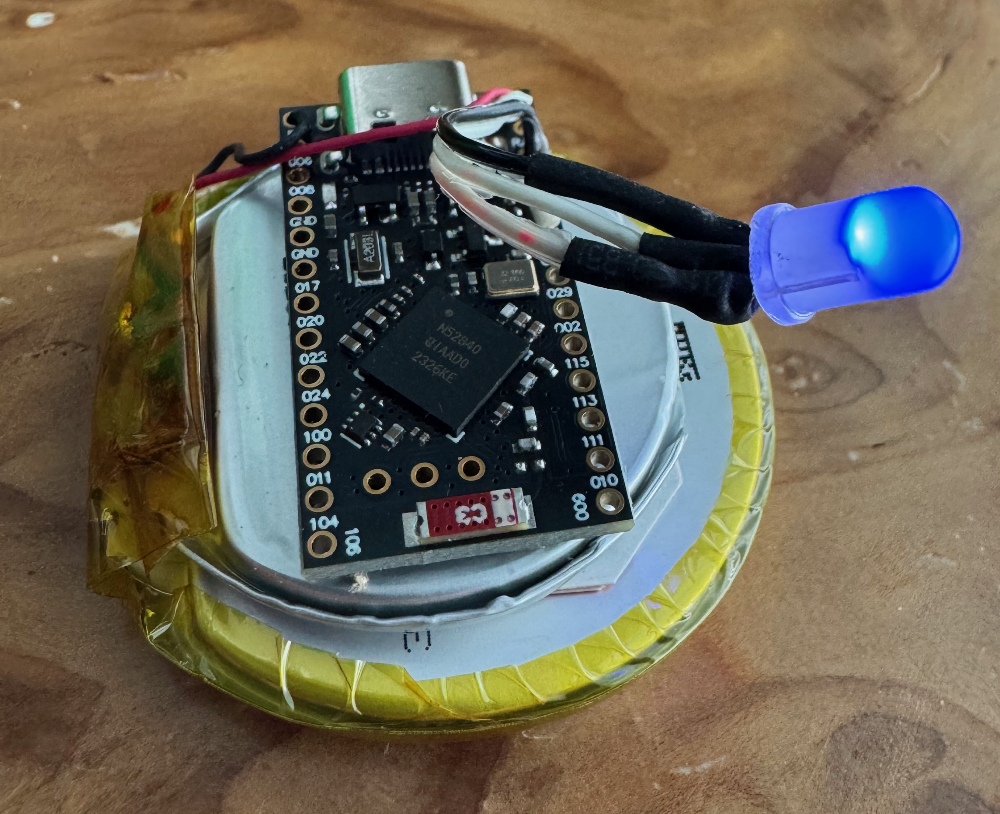
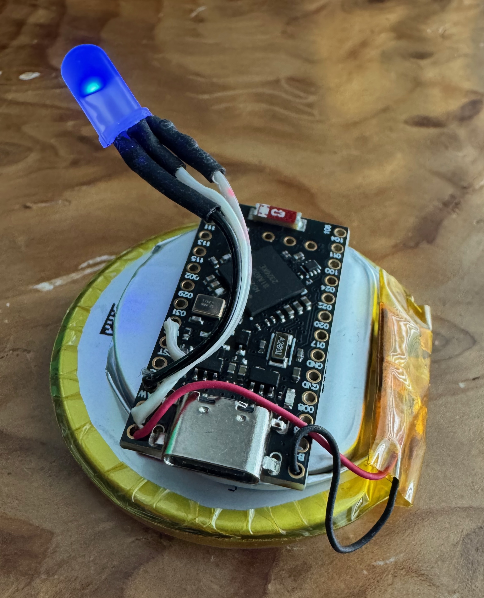
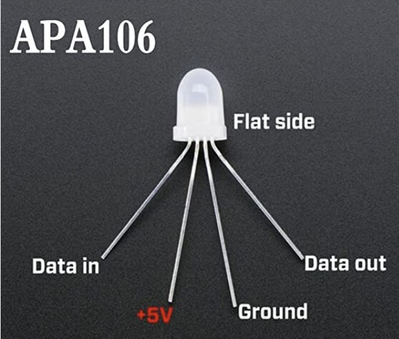

# Overview
This is a simple project to make a blue LED appear to "surge" by
ramping the brightness.
It's made from a low-power MCU and an addressable
RGB LED ("NeoPixel").
The ramping code is CircuitPython.
The hardware is designed to fit inside a 50 mm OD hemisphere, forming
the base of a Marvel Crisis Protocol figure.




# Hardware
* NRF52840 Low Power MCU https://www.amazon.com/dp/B0DCZJKYL1
* 5 mm RGB LED with integrated controller, often called "NeoPixel" by Adafruit, or goes by part number WS2811 or WS2812: https://www.amazon.com/gp/product/B071FND4WK/
* Grepow Round LiPo Battery 1050 mAh, 45 mm: https://www.digikey.com/en/products/detail/grepow-inc/GRP604543-1C-3-85V-1050mAh/25603150?so=90319449&content=productdetail_US&mkt_tok=MDI4LVNYSy01MDcAAAGXr0zTNGL7wMcj38zS1NfjL6Q7xzH_l-0sC5THc_biOnrfHwN7NdhwYNRqPiH4JZ-apJNsMh8thvSx2h9nwQoZm2Vlo7oKb3b1kgkJKPx-
  * This version doesn't have the protection circucit
  * It was the only one of this capacity and size when I ordered
  * I just soldered it on to the protection circuit of the cell below
* Grepow Round LiPo Battery 545 mAh, 35 mm: https://www.digikey.com/en/products/detail/grepow-inc/GRP483535-3-8V-545MAH/13681485?so=90319449&content=productdetail_US&mkt_tok=MDI4LVNYSy01MDcAAAGXr0zTNAtJcplwHox_k0W8KSOCDloVeDbT4WClvMhRKBXPA4Vr-a3-AFvQYgoRceVQyRZ09_RcBqg_5khpOIdrx1zLAItp0yezYCWb8aXO


# Software
* Circuit Python 9.2.1. Binary in `Downloads`.
* NeoPixel Driver Libary for above, extracted from `adafruit-circuitpython-bundle-9.x-mpy-20241224`. Binary in `Downloads`.

# Software Installation
* When you plug in the NRF52840 fresh from the factory, it will mount the MCU flash for running firmware as a volume named `NICENANO`.
* Copy the CircuitPython `.UF2` file from `Downloads` to that volume to install the firmware on the flash of the MCU.
```
cp Downloads/adafruit-circuitpython-supermini_nrf52840-en_US-9.2.1.uf2 /Volumes/NICENANO
```
* Successful installation of CircuitPython will cause the MCU to reboot, so you'll get a warning message that the `NICENANO` volume was not ejected before disconnecting. This is expected.
* When CircuitPython boots, it will mount the flash used for running CircuitPython code as a volume named `CIRCUITPY`.
* Copy the NeoPixel library from `Downloads` into the `/lib/` directory of that volume.
```
cp Downloads/neopixel.mpy /Volumes/CIRCUITPY/lib/
```
* Finally copy the SurgeBase code to the `CIRCUITPY` volume.
```
cp fw/code.py /Volumes/CIRCUITPY
```
* Eject the `CIRCUITPY` volume.
* Plug out the MCU and then plug it back in. The MCU should reboot and start running SurgeBase if you haven't attached a battery.

# Construction
* Spread four leads of LED.
* Cut off the one on the flat side. (It would daisy chain to the next LED in sequence, but we're only using one.)
* Cut the remaining three legs where they have a crimp mark.
* Prepare three stranded wires about 45 mm to connect the LED to the MCU.
* Prepare three pieces of heat shrink tubing about 8 mm.
* Strip about 5 mm of insulation.
* If PVC insulation, be ready for it to shrink back several mm when soldered.
* If ribbon cable, split LED end back so when heat shrink is placed over it, at least 5 mm of insulation is exposed.
* Place heat shrink tubing over wires.
* Tin ends.
* Solder LED to tinned wires.
* Slide tubing over solder joints and heat to shrink.
* Solder wires to MCU following table below.

| NeoPixel Pin | MCU Pin |
|--------------|---------|
| `Data In`    | `031`   |
| `+5 V`       | `B+`    |
| `Ground`     | `GND`   |
| `Data Out`   | N/C     |

* If 1050 mAh batter doesn't have a BMS or Protection Circuit Module (PCM) but the 545 mAh battery does, then kludge them to both use the same BMS:
  * Charge both batteries fully.
  * Remove tape on BMS.
  * Tin cell tabs on both batteries.
  * Solder cells in parallel.
  * Insulate with Kapton tape.
* Solder battery to `B-` and `B+` pins of MCU.
* Use foam mounting tape to secure batteries and PCB.
* Use putty to stick assembly to shell.

# Troubleshooting
* If light blinks, MCU may by hung from power glitches while soldering the battery. Try briefly shorting the MCU `RST` pin to `GND` to reset it.
* For debugging or development, connect MCU USB to a host and run a terminal emulator on the USB serial port at 115200 baud.
```
screen /dev/cu.usbmodem11401
```
* You may have to hit `Control-C` to interrupt Circuit Python to get a REPL prompt if it's busy running your code.
